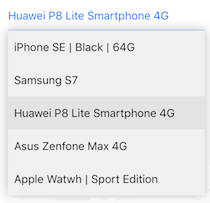
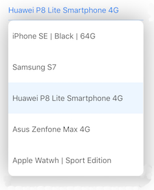
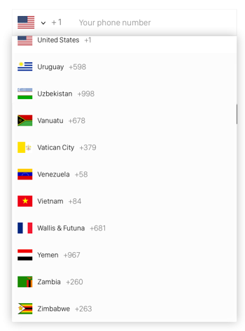

[](https://twitter.com/banhmixaolan)
[](https://github.com/AssistoLab/DropDown/blob/master/README.md)
[](https://github.com/FPTInformationSystem/Dropdown-Xamarin-iOS)
[](https://github.com/AssistoLab/DropDown)
[](http://)
[](http://)


A Material Design drop down for iOS written in C#.
***

[](Screenshots/1.png)
[](Screenshots/2.png)
[](Screenshots/3.png)

## Demo

Open Solution. Compile and Run the Demo project.

## Installation 📱

We support Xamarin.iOS. DLLs can be found in https://github.com/FPTInformationSystem/Dropdown-Xamarin-iOS/tree/master/FPT.Framework.iOS.UI.Dropdown/Lib/DLLs

### Nugets & Xamarin Components

Sorry, I am currently very busy. I will post it to Nuget and Xamarin Components as soon as possible


### Source files

A regular way to use DropDown in your project would be using Reference Assembly. There are two approaches, using source code and adding submodule.

Add source code:

1. Download the [latest code version](https://github.com/FPTInformationSystem/Dropdown-Xamarin-iOS/archive/master.zip).
2. Unzip the download file, add `FPT.Framework.iOS.UI.DropDown` project to your project folder

Add DLLs

1. Add the assembly `FPT.Framework.iOS.UI.Dropdown.DLL`

## Basic usage ✨

Currently, We don't support UIBarButtonItem yet!!!

We also currently have issue with AnchorView because C# does not allow Extension class + Implement interface for built-in UIKit's class.
So we use Swift version here instead. We are trying to improve this soon. Note that usage with `(Updating)` maybe not guarantee to work.

```C#
var dropDown = new DropDown();

// The view to which the drop down will appear on
dropDown.AnchorView = new WeakReference<UIView>(view); // UIView or UIBarButtonItem

// The list of items to display. Can be changed dynamically
dropDown.DataSource = new string[] { "Car", "Motorcycle", "Truck" };
```

Optional properties:

```C#
// Action triggered on selection
dropDown.SelectionAction = (nint index, string item) =>
{
	Console.WriteLine("Select item: {0} at index: {1}", item, index);
};

// Will set a custom width instead of the anchor view width
dropDownLeft.Width = 200f;
```

Display actions:

```C#
dropDown.Show();
dropDown.Hide();
```

## Important ⚠️

Don't forget to put:

```C#
DropDown.StartListeningToKeyboard();
```

in your `AppDelegate`'s `DidFinishLaunching` method so that the drop down will handle its display with the keyboard displayed even the first time a drop down is showed.

## Advanced usage 🛠

### Direction

The drop down can be shown below or above the anchor view with:
```swift
dropDown.Direction = Direction.Any;
```

With `Direction.Any` the drop down will try to displa itself below the anchor view when possible, otherwise above if there is more place than below.
You can restrict the possible directions by using `Direction.Top` or `Direction.Bottom`.

### Offset (Updating)

By default, the drop down will be shown onto to anchor view. It will hide it.
If you need the drop down to be below your anchor view when the direction of the drop down is `Direction.Bottom`, you can precise an offset like this:

```swift
// Top of drop down will be below the anchorView
dropDown.BottomOffset = new CGPoint(x: 0, y:(dropDown.anchorView?.plainView.bounds.height)!)
```

If you set the drop down direction to `Direction.Any` or `Direction.Top` you can also precise the offset when the drop down will shown above like this:

```swift
// When drop down is displayed with `Direction.top`, it will be above the anchorView
dropDown.topOffset = CGPoint(x: 0, y:-(dropDown.anchorView?.plainView.bounds.height)!)
```
*Note the minus sign here that is use to offset to the top.*

### Cell configuration

#### Formatted text

By default, the cells in the drop down have the `dataSource` values as text.
If you want a custom formatted text for the cells, you can set `cellConfiguration` like this:

```C#
dropDown.CustomCellConfiguration = (nint index, string item, DropDownCell cell) =>
{
  
}
```

#### Custom cell (updating)

You can also create your own custom cell, from your .xib file. To have something like this for example:
<br/>[](Screenshots/3.png)

For this you have to:

- Create a [`DropDownCell`](DropDown/src/DropDownCell.swift) subclass (e.g. *MyCell.swift*)
```swift
class MyCell: DropDownCell {
   @IBOutlet weak var suffixLabel: UILabel!
}
```
- Create your custom xib (e.g. *MyCell.xib*) and design your cell view in it
<br/>
- Link the cell in your xib to your custom class
<br/>
- At least have a label in your xib to link to the [`optionLabel`](DropDown/src/DropDownCell.swift#L14) `IBOutlet` in code (`optionLabel` is a property of `DropDownCell`)
<br/>
- Then, you simply need to do this:
```swift
let dropDown = DropDown()

// The view to which the drop down will appear on
dropDown.anchorView = view // UIView or UIBarButtonItem

// The list of items to display. Can be changed dynamically
dropDown.dataSource = ["Car", "Motorcycle", "Truck"]

/*** IMPORTANT PART FOR CUSTOM CELLS ***/
dropDown.cellNib = UINib(nibName: "MyCell", bundle: nil)

dropDown.customCellConfiguration = { (index: Index, item: String, cell: DropDownCell) -> Void in
   guard let cell = cell as? MyCell else { return }

   // Setup your custom UI components
   cell.suffixLabel.text = "Suffix \(index)"
}
/*** END - IMPORTANT PART FOR CUSTOM CELLS ***/
```
- And you're good to go! 🙆

For a complete example, don't hesitate to check the demo app and code.

### Events

```C#
dropDown.CancelAction = ()=>
{
  Console.WriteLine("Drop down dismissed");
}

dropDown.WillShowAction = ()=>
{
 Console.WriteLine("Drop down will show);
}
```

### Dismiss modes

```C#
dropDown.DismissMode = DismissMode.OnTap;
```

You have 3 dismiss mode with the `DismissMode` enum:

- `OnTap`: A tap oustide the drop down is needed to dismiss it (Default)
- `Automatic`: No tap is needed to dismiss the drop down. As soon as the user interact with anything else than the drop down, the drop down is dismissed
- `Manual`: The drop down can only be dismissed manually (in code)

### Others

You can manually (pre)select a row with:

```swift
dropDown.SelectRow(index: 3);
```

The data source is reloaded automatically when changing the `dataSource` property.
If needed, you can reload the data source manually by doing:

```C#
dropDown.ReloadAllComponents();
```

You can get info about the selected item at any time with this:

```C#
dropDown.SelectedItem // string
dropDown.IndexForSelectedRow // int?
```

## Customize UI 🖌(updating)

You can customize these properties of the drop down:

- `textFont`: the font of the text for each cells of the drop down.
- `textColor`: the color of the text for each cells of the drop down.
- `backgroundColor`: the background color of the drop down.
- `selectionBackgroundColor`: the background color of the selected cell in the drop down.
- `cellHeight`: the height of the drop down cells.

You can change them through each instance of `DropDown` or via `UIAppearance` like this for example:

```swift
DropDown.appearance().textColor = UIColor.black
DropDown.appearance().textFont = UIFont.systemFont(ofSize: 15)
DropDown.appearance().backgroundColor = UIColor.white
DropDown.appearance().selectionBackgroundColor = UIColor.lightGray
DropDown.appearance().cellHeight = 60
```

## Expert mode 🤓

when calling the `show` method, it returns ComputeLayoutTuple:

```C#
public nfloat X;
public nfloat Y;
public nfloat Width;
public nfloat OffscreenHeight;
public nfloat VisibleHeight;
public bool CanBeDisplayed;
public Direction Direction;
```

- `canBeDisplayed`: Tells if there is enough height to display the drop down. If its value is `false`, the drop down is not showed.
- `offscreenHeight`: If the drop down was not able to show all cells from the data source at once, `offscreenHeight` will contain the height needed to display all cells at once (without having to scroll through them). This can be used in a scroll view or table view to scroll enough before showing the drop down.

## Requirements

* Xamarin.iOS
* Xcode 8+
* C# 6.0
* iOS 8+
* ARC

## License

This project is under MIT license. For more information, see `LICENSE` file.

## Credits

DropDown was inspired by the Swift version of the [DropDown](https://github.com/AssistoLab/DropDown).

It will be updated when necessary and fixes will be done as soon as discovered to keep it up to date.

I work at<br/>
[](http://fis.com.vn)

You can find me on Twitter [@banhmixaolan](https://twitter.com/banhmixaolan).

Enjoy!
